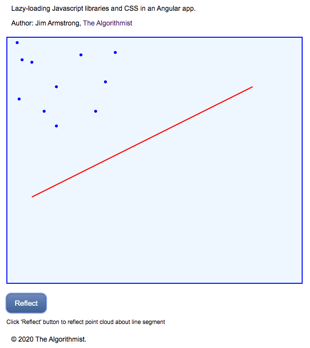
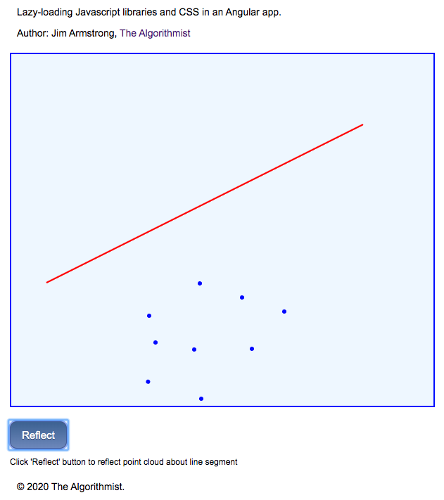

# Angular 9 Lazy-Loading External Libraries and Styles

This repo illustrates the complete end-to-end process of lazy-loading both external libraries (.js) and styles (.css) from an Angular 9 Component.  A 'lite' version of my client-only Angular Dev Toolkit lazy-loading library is provided with the distribution.  Error handling a couple very minor features have been removed from the client-proprietary version of this library.

Author:  Jim Armstrong - [The Algorithmist](https://www.linkedin.com/in/jimarmstrong/)

@algorithmist

theAlgorithmist [at] gmail [dot] com

Typescript Library: Beta 1.0

Angular: 9.0.0

Angular CLI: 9.0.1

Typescript: 3.7.5

Pixi JS: 4.8.1

# Introduction

The specific problem illustrated in this example is reflecting a 2D point cloud about a line.  An external library is loaded to perform the necessary computations.  This simulates a situation when an infrequently-used Component (likely in an already lazy-loaded route) loads its resources 'on demand' so that they are only present in the application if they are actually used.

I took a few of the classes in my proprietary Typescript Math Toolkit and edited the compiled JS, output from the Typescript compiler.  Specifically, I removed all the module/export code and the _require_ statements.  Two of the TypeScript 'classes' are straight functions in the JS code; the primary utility class is an IIFE.  The code was concatenated by hand into a library in _/src/assets/libs/point-libs.js_.  External code and styles should be in a folder that is copied to the _dist_ folder when the application is built.  I always tend to use the _assets_ folder.  You will see there are _libs_ and _styles_ sub-folders.

An attribute directive is used to display the point cloud and line segment in a PixiJS Canvas.  The main app component lazy-loads the _point-libs.js_ file, some external CSS, and the display is updated after external resources finish loading.  Since the drawing-area display is contingent on successful load of external resources, referencing the attribute directive and updating the display is more complex than would normally be encountered in an Angular application. 

Now, error-handling is not considered in the demo as I can not publicly release the **exact** same copy of code that has been used in proprietary client applications.  Such handling is, however, easy to add and is left as an exercise.

# External Script

Three Typescript 'classes' are provided in the _/src/assets/libs/point-libs.js_ file.  The primary utility of interest is _TSMT$PointUtils_.  The Typescript compiler compiles all 'classes' down to IIFE in the Javascript file.  There is also a _TSMT$Point_ function in the file that is present as a straight function.  _TSMT$PointUtils_ was left as an IIFE.

This code distribution shows how to work with both _TSMT$Point_ and _TSMT$PointUtils_.  There is no interface or definitions file for the former, so we have to rely on some prior knowledge of the functionality provided by that object.  An interface for the point utilities 'class' is provided in _/src/app/shared/point-utils.ts_.

# Lazy Loading

The lazy-loading library is provided in _/src/app/shared/libs/lazy-load-libs.ts_.  A single public method, _load_, is provided to lazy-load an external file that must have either a 'js' or 'css' extension.  An _Observable_ is returned that can be subscribed to for indication of when the loads are complete.  Completion of this _Observable_ indicates that the loaded script has already been assigned to a _</script>_ tag in the document.  Styles are handled in a similar manner.

# Main Application

Since we can't display anything until external resources are loaded, the Component's template has a 'loading' section.  This is similar to examples you have likely seen in the past,

```
<ng-template #libsLoading>
  <p>Loading libraries ...</p>
</ng-template>

<div *ngIf="libraryRef else libsLoading">
  <div class="mt10 mainContainer main-border" reflect></div>
  <button class="blue-button mt10" [disabled]="!available" (click)="onReflect()">Reflect</button>
  <p class="instruction">{{instructions}}</p>
</div>
```

The main UI is not fully displayed until after a complete load of all external resources.  The 'Reflect' button is disabled until we have a completely defined reference to the attribute directive used to control the display.

While a _ViewChild_ would normally be used, _ViewChildren_ is used in the application as the directive display is not deterministic; it varies over time.  _ViewChildren_ defines a _QueryList<T>_ that has a _changes Observable_ to which we can subscribe.  This informs us *exactly* when the view child is available for reference.

```
  @ViewChildren(ReflectDirective)
  private _reflector: QueryList<ReflectDirective>;
  .
  .
  .
  
  public ngAfterViewInit(): void
  {
    this._reflector.changes.subscribe( () => this.__onReflector() )
  }
  
  .
  .
  .
  
  private __onReflector(): void
  {
    // extract the view child from the view children collection and indicate it is available for use
    this._pointReflector = this._reflector.first;
    this.available       = true;
  
    // draw the initial point cloud and reflection line
    this._pointReflector.drawPoints(this._pointCloud);
    this._pointReflector.defineLineSegment(this._x0, this._y0, this._x1, this._y1);
  
    // this all happens well outside the normal Angular component lifecycle due to lazy-loading external JS and CSS
    this._chgDetectorRef.detectChanges();
  }
```

Loading of external resources happens outside the Angular Component lifecycle and in a manner that does not automatically trigger change detection, so the latter is done manually.

This component requests the external resources in its on-init handler,

```
  public ngOnInit(): void
  {
    forkJoin([
      this._loader.load('assets/libs/point-libs.js'),
      this._loader.load('assets/styles/container-styles.css')
    ]).
    subscribe( (arr: any[]) => this.__onLibraryLoaded(arr) );
  }
```

The most important code occurs in the ___onLibraryLoaded()_ handler,

```
 private __onLibraryLoaded(arr: any[]): void
  {
    // TSMT$PointUtils is an IIFE
    this._pointUtils = window['TSMT$PointUtils'];

    if (this._pointUtils !== undefined)
    {
      this.libraryRef = true;

      // example usage
      const d: number = this._pointUtils.l2Norm({x: 0, y: 1}, {x: 1, y: 0});
      console.log('distance between (0,1) and (1,0) is sqrt(2):', d);

      // TSMT$Point is a function; we don't have a definitions file or an interface for a TSMT$Point, so it has to be typed to 'any'
      const point: any = new window['TSMT$Point'](1, 1);

      console.log('point length:', point.length());
    }
  }
```

After loading, anything defined in the external script file is available as a property in the global (window) scope.  Since _TSMT$Point_ is a function, it must be instantiated (constructor invocation).  _TSMT$PointUtils_ is an IIFE, so it is available for immediate use, 'as is'.


# Run The Application

Nothing new - _ng serve_ and _localhost:4200_.  The initial UI appears as follows,



Click on the 'Reflect' button to reflect the point cloud about the line segment,



## Further help

To get more help on the Angular CLI use `ng help` or go check out the [Angular CLI README](https://github.com/angular/angular-cli/blob/master/README.md).
